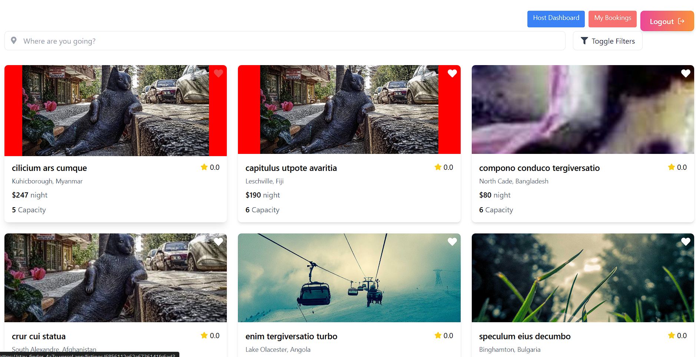

# StayFinder 🏠

A full-stack property rental web application similar to Airbnb, built with the MERN stack. Users can list properties, search for accommodations, and make bookings for short-term or long-term stays.




[Live-Link](https://stay-finder-4a7u.vercel.app/)

## 🚀 Features

### Core Features
- **Property Listings**: Browse properties with images, location, and pricing
- **Detailed Property View**: Comprehensive property pages with image galleries, descriptions, and availability calendar
- **User Authentication**: Secure registration and login system with JWT tokens
- **Booking System**: Complete reservation functionality with date selection
- **Host Dashboard**: Property management interface for hosts to create, edit, and manage listings

### Bonus Features ✨
- **Advanced Search & Filters**: Filter by location, price range, dates, and property type
- **Interactive Maps**: Mapbox integration showing property locations
- **Mock Payment Integration**: Simulated payment processing workflow
- **Responsive Design**: Mobile-first approach with Tailwind CSS

## 🛠️ Tech Stack

### Frontend
- **React 18** - Modern UI library with hooks
- **Redux Toolkit** - Predictable state management
- **React Router** - Client-side routing
- **Tailwind CSS** - Utility-first CSS framework
- **React Icons** - Comprehensive icon library
- **Mapbox GL JS** - Interactive maps integration
- **Axios** - HTTP client for API requests

### Backend
- **Node.js** - JavaScript runtime
- **Express.js** - Web application framework
- **MongoDB** - NoSQL database
- **Mongoose** - MongoDB object modeling
- **JWT** - JSON Web Tokens for authentication
- **Bcryptjs** - Password hashing
- **Multer** - File upload handling
- **Cors** - Cross-origin resource sharing

### Development Tools
- **Vite** - Fast build tool and dev server
- **ESLint** - Code linting
- **Prettier** - Code formatting
- **Nodemon** - Auto-restart development server

## 📁 Project Structure

```
stayfinder/
├── frontend/
│   ├── src/
│   │   ├── components/     # Reusable UI components
│   │   ├── features/       # Feature-based component organization
│   │   ├── store/          # Redux store configuration
│   │   ├── pages/          # Route-based page components
│   │   ├── utils/          # Helper functions and utilities
│   │   ├── hooks/          # Custom React hooks
│   │   └── App.jsx         # Main application component
│   ├── public/
│   └── package.json
└── backend/
    ├── routes/             # API route definitions
    ├── models/             # Database models (User, Listing, Booking)
    ├── middleware/         # Custom middleware functions
    ├── config/             # Database and app configuration
    ├── routes/listingimages/  # Image upload handling
    ├── server.js           # Main server file
    └── package.json
```

## 🗄️ Database Models

### User Model
```javascript
firstName: {
    type: String,
    required: [true, 'First name is required'],
    trim: true,
    maxlength: [50, 'First name cannot exceed 50 characters']
  },
  lastName: {
    
    type: String,
    required: [true, 'Last name is required'],
    trim: true,
    maxlength: [50, 'Last name cannot exceed 50 characters']
  },
  email: {
    type: String,
    required: [true, 'Email is required'],
    unique: true,
    lowercase: true,
    match: [/^\w+([.-]?\w+)*@\w+([.-]?\w+)*(\.\w{2,3})+$/, 'Please enter a valid email']
  },
  password: {
    type: String,
    required: [true, 'Password is required'],
    minlength: [6, 'Password must be at least 6 characters'],
    select: false
  },
  phone: {
    type: String,
    required: [true, 'Mobile Number is required'],
    trim: true
  },
  avatar: {
    type: String,
    default: 'https://img.freepik.com/free-vector/smiling-young-man-illustration_1308-174669.jpg?semt=ais_hybrid&w=740'
  },
  dateOfBirth: Date,
  role: {
    type: String,
    enum: ['guest', 'host', 'admin'],
    default: 'guest'
  },
  isVerified: {
    type: Boolean,
    default: false
  },
  verificationToken: String,
  resetPasswordToken: String,
  resetPasswordExpire: Date,
  location: {
    address: String,
    city: String,
    country: String,
    coordinates: {
      lat: Number,
      lng: Number
    }
  },
  preferences: {
    currency: {
      type: String,
      default: 'USD'
    },
    language: {
      type: String,
      default: 'en'
    },
    notifications: {
      email: { type: Boolean, default: true },
      sms: { type: Boolean, default: false },
      push: { type: Boolean, default: true }
    }
  },
  hostProfile: {
    bio: String,
    responseRate: { type: Number, default: 0 },
    responseTime: String,
    joinedDate: { type: Date, default: Date.now },
    superhost: { type: Boolean, default: false },
    verifications: [{
      type: { type: String },
      verified: { type: Boolean, default: false },
      verifiedAt: Date
    }]
  }
}, {
  timestamps: true
}
```

### Listing Model
```javascript
{
 title: {
    type: String,
    required: [true, 'Title is required'],
    trim: true,
    maxlength: [100, 'Title cannot exceed 100 characters']
  },
  description: {
    type: String,
    required: [true, 'Description is required'],
    maxlength: [2000, 'Description cannot exceed 2000 characters']
  },
  host: {
    type: mongoose.Schema.Types.ObjectId,
    ref: 'User',
    required: true
  },
  propertyType: {
    type: String,
    required: true,
    enum: ['apartment', 'house', 'villa', 'condo', 'townhouse', 'cabin', 'loft', 'other']
  },
  roomType: {
    type: String,
    required: true,
    enum: ['entire-place', 'private-room', 'shared-room']
  },
  location: {
    address: { type: String, required: true },
    city: { type: String, required: true },
    country: { type: String, required: true },
    coordinates: {
      type: {
        type: String,
        enum: ['Point'],
        required: true,
        default: 'Point'
      },
      coordinates: {
        type: [Number],
        required: true,
        default: [0, 0],
        validate: {
          validator: function (v) {
            return v.length === 2 &&
              v[0] >= -180 && v[0] <= 180 &&
              v[1] >= -90 && v[1] <= 90;
          },
          message: props => `${props.value} is not a valid longitude/latitude pair`
        }
      }
    }
  },
  pricing: {
    basePrice: {
      type: Number,
      required: true,
      min: [1, 'Price must be at least $1']
    },
    currency: {
      type: String,
      default: 'USD'
    },
    weeklyDiscount: {
      type: Number,
      min: 0,
      max: 50,
      default: 0
    },
    monthlyDiscount: {
      type: Number,
      min: 0,
      max: 50,
      default: 0
    },
    cleaningFee: {
      type: Number,
      default: 0
    },
    serviceFee: {
      type: Number,
      default: 0
    },
    taxRate: {
      type: Number,
      default: 0
    }
  },
  capacity: {
    guests: {
      type: Number,
      required: true,
      min: 1
    },
    bedrooms: {
      type: Number,
      required: true,
      min: 0
    },
    beds: {
      type: Number,
      required: true,
      min: 1
    },
    bathrooms: {
      type: Number,
      required: true,
      min: 0.5
    }
  },
  amenities: [{
    type: String,
    enum: [
      'wifi', 'kitchen', 'washer', 'dryer', 'air-conditioning', 'heating',
      'tv', 'hot-tub', 'pool', 'gym', 'parking', 'elevator', 'wheelchair-accessible',
      'pet-friendly', 'smoking-allowed', 'events-allowed', 'fireplace',
      'breakfast', 'laptop-friendly', 'family-friendly', 'suitable-for-infants'
    ]
  }],
  images: [{
    url: { type: String, required: true, default: "http://localhost:500/api/listingimages/default.png" },
    originalname: { type: String, required: true },
    mimetype: { type: String, required: true },
    size: { type: Number, required: true },
    caption: String,
    isPrimary: { type: Boolean, default: false },
    uploadedAt: { type: Date, default: Date.now }
  }],
  availability: {
    minStay: {
      type: Number,
      default: 1
    },
    maxStay: {
      type: Number,
      default: 365
    },
    instantBook: {
      type: Boolean,
      default: true
    },
    advanceNotice: {
      type: String,
      enum: ['same-day', '1-day', '2-days', '3-days', '7-days'],
      default: 'same-day'
    },
    preparationTime: {
      type: Number,
      default: 0
    },
    availabilityWindow: {
      type: Number,
      default: 365
    },
    blockedDates: [{
      startDate: Date,
      endDate: Date,
      reason: String
    }]
  },
  houseRules: [{
    type: String,
    maxlength: [200, 'House rule cannot exceed 200 characters']
  }],
  cancellationPolicy: {
    type: String,
    enum: ['flexible', 'moderate', 'strict', 'super-strict'],
    default: 'moderate'
  },
  status: {
    type: String,
    enum: ['draft', 'active', 'inactive', 'suspended'],
    default: 'draft'
  },
  metrics: {
    views: { type: Number, default: 0 },
    favorites: { type: Number, default: 0 },
    rating: { type: Number, default: 0 },
    reviewCount: { type: Number, default: 0 }
  },
  featured: {
    type: Boolean,
    default: false
  },
  createdAt: {
    type: Date,
    default: Date.now
  },
  updatedAt: {
    type: Date,
    default: Date.now
  }
}, {
  timestamps: true
}
```

### Booking Model
```javascript
listing: {
    type: mongoose.Schema.Types.ObjectId,
    ref: 'Listing',
    required: true
  },
  guest: {
    type: mongoose.Schema.Types.ObjectId,
    ref: 'User',
    required: true
  },
  host: {
    type: mongoose.Schema.Types.ObjectId,
    ref: 'User',
    required: true
  },
  checkIn: {
    type: Date,
    required: true
  },
  checkOut: {
    type: Date,
    required: true
  },
  guests: {
    adults: { type: Number, required: true, min: 1 },
    children: { type: Number, default: 0, min: 0 },
    infants: { type: Number, default: 0, min: 0 }
  },
  totalGuests: {
    type: Number,
    required: true
  },
  nights: {
    type: Number,
    required: true
  },
  pricing: {
    basePrice: { type: Number, required: true },
    totalNights: { type: Number, required: true },
    subtotal: { type: Number, required: true },
    cleaningFee: { type: Number, default: 0 },
    serviceFee: { type: Number, default: 0 },
    taxes: { type: Number, default: 0 },
    discounts: {
      weekly: { type: Number, default: 0 },
      monthly: { type: Number, default: 0 },
      coupon: { type: Number, default: 0 }
    },
    total: { type: Number, required: true }
  },
  status: {
    type: String,
    enum: ['pending', 'confirmed', 'cancelled', 'completed'],
    default: 'pending'
  },
  paymentStatus: {
    type: String,
    enum: ['pending', 'paid', 'refunded', 'failed'],
    default: 'pending'
  },
  paymentDetails: {
    stripePaymentIntentId: String,
    stripeChargeId: String,
    paymentMethod: String,
    currency: { type: String, default: 'USD' }
  },
  specialRequests: String,
  cancellation: {
    cancelledBy: {
      type: String,
      enum: ['guest', 'host', 'admin']
    },
    cancelledAt: Date,
    reason: String,
    refundAmount: Number
  },
  communication: [{
    from: {
      type: mongoose.Schema.Types.ObjectId,
      ref: 'User'
    },
    message: String,
    timestamp: {
      type: Date,
      default: Date.now
    },
    type: {
      type: String,
      enum: ['message', 'system', 'automated'],
      default: 'message'
    }
  }]
}, {
  timestamps: true
}
```

## 🚦 API Endpoints (Working)

### Authentication
- `POST /api/auth/register` - User registration
- `POST /api/auth/login` - User login
- `GET /api/auth/me` - Get user profile

### Listings
- `GET /api/listings` - Get all listings with filters
- `GET /api/listings/:id` - Get specific listing
- `POST /api/listings` - Create new listing (hosts only)
- `PUT /api/listings/:id` - Update listing (host only)
- - `GET /api/listings/host/my-listings` -Host listings (host only)
- `DELETE /api/listings/:id` - Delete listing (host only)

### Bookings
- `POST /api/bookings` - Create new booking
- `GET /api/bookings/my-bookings` - Get user's bookings
- `GET /api/bookings/:id` - Get bookings by id
-  `GET /api/bookings/:id/status` - Update booking status (Host only)
-  `GET /api/bookings/:id/cancel` -cancel booking

### Payments
- `POST /api/payments/create-payment-intent` - Create payment intent
- `POST /api/payments/confirm-payment` -Confirm payment

## 🚀 Getting Started

### Prerequisites
- Node.js (v16 or higher)
- MongoDB (local or Atlas)
- Git

### Installation

1. **Clone the repository**
```bash
git clone https://github.com/yourusername/stayfinder.git
cd stayfinder
```

2. **Backend Setup**
```bash
cd backend
npm install

# Create .env file
echo "MONGODB_URI=mongodb://localhost:27017/stayfinder
JWT_SECRET=your_jwt_secret_here
NODE_ENV=development
PORT=5000" > .env

# Start the server
npm run dev
```

3. **Frontend Setup**
```bash
cd ../frontend
npm install

# Create .env file
echo "VITE_API_URL=http://localhost:5000/api
VITE_MAPBOX_TOKEN=your_mapbox_token_here" > .env

# Start the development server
npm run dev
```

4. **Seed Database (Optional)**
```bash
cd backend
npm run seed
```

### Environment Variables

#### Backend (.env)
```
MONGODB_URI=mongodb://localhost:27017/stayfinder
JWT_SECRET=your_super_secret_jwt_key
NODE_ENV=development
PORT=5000
```

#### Frontend (.env)
```
VITE_API_URL=http://localhost:5000/api
VITE_MAPBOX_TOKEN=your_mapbox_access_token
```

## 🧪 Testing

The application includes seed data for testing purposes:
- Sample properties in various locations
- Test user accounts (host and guest roles)
- Mock booking data

### Test Accounts
- **Host**: ap410485@gmail.com.com / Amanwa
- **Guest**: ap41045@gmail.com / Amanwa

## 🔒 Security Features

- **JWT Authentication**: Secure token-based authentication
- **Password Hashing**: Bcrypt for secure password storage
- **Input Validation**: Server-side validation for all endpoints
- **CORS Configuration**: Controlled cross-origin requests
- **Rate Limiting**: API rate limiting to prevent abuse
- **File Upload Security**: Validated image uploads with size limits

## 📱 Responsive Design

The application is fully responsive and tested on:
- Desktop (1920px+)
- Tablet (768px - 1024px)
- Mobile (320px - 767px)

## 🚀 Deployment

### Frontend (Vercel/Netlify)
```bash
npm run build
npm run dev
# Deploy dist folder
```

### Backend (Heroku/Railway)
```bash
# Set environment variables in deployment platform
# Deploy with MongoDB Atlas connection
npm install
npm start or npm run dev
npm run seed for seeding mock data 
```

## 🎯 Future Enhancements

- Real-time chat between hosts and guests
- Advanced calendar management
- Email notifications for bookings
- Review and rating system
- Multi-language support
- Progressive Web App (PWA) features

## 🤝 Contributing

1. Fork the repository
2. Create a feature branch (`git checkout -b feature/AmazingFeature`)
3. Commit your changes (`git commit -m 'Add some AmazingFeature'`)
4. Push to the branch (`git push origin feature/AmazingFeature`)
5. Open a Pull Request

## 📄 License

This project is licensed under the MIT License - see the [LICENSE.md](LICENSE.md) file for details.

## 👨‍💻 Author

**Your Name**
- GitHub: [@yourusername](https://github.com/CreatorRama)
- LinkedIn: [Your LinkedIn](https://linkedin.com/in/aman-pandey-237728259)
- Email: ap410485@gmail.com

## 🙏 Acknowledgments

- Airbnb for design inspiration
- Mapbox for mapping services
- The React and Node.js communities
- All contributors and testers

---

*Built with ❤️ for the StayFinder Internship Project*
